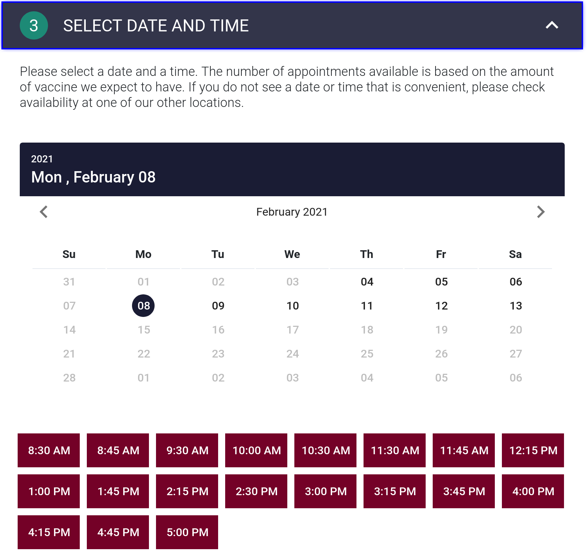

1. Click "Select Date and Time"
2. Select the date most convenient to you.
   1. **_Note_**: As vaccine availability is based on the location, consider reviewing the list of vaccine centers and having 3-4 preferred locations beforehand.
3. **If you see a moving progress bar under the calendar**:
   1. Wait up to 1 minute
   2. If after 1 minute, the progress bar is still moving and no times appear, select a different date and return to step 2.
4. **If you see no available time slots**: Select a different [location](./location) and try again.
5. Select a time slot most convenient to you
6. **If you receive a message on the top regarding a network error**:
   1. Refresh the page and [start over](./dosage)
6. **If you see a moving progress bar under the calendar**:
   1. Wait up to 1 minute
   2. If after 1 minute, the progress bar is still moving and no times appear, select a different date and return to step 2.
7. **If you see the error message**: "You have tried to reserve too many appointment slots. Please try again later":
   1. Refresh the page and return to the [dosage](./dosage) step as the available dosages have changed.

[<button>Previous Step</button>](./location)
[<button>Next Step</button>](./contact)

## Example

