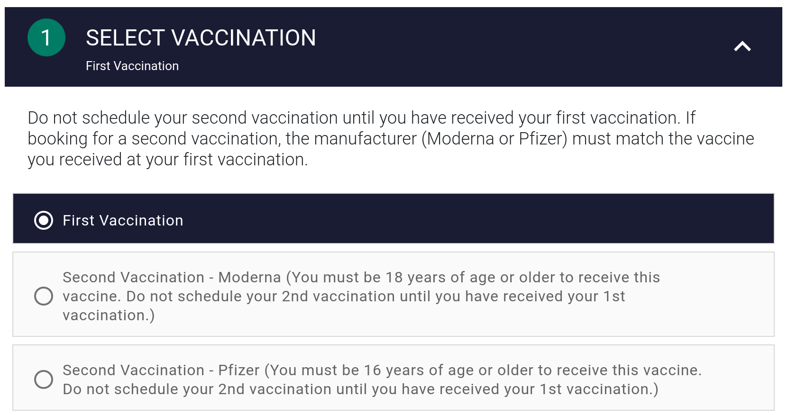

1. Visit the [Cook County Health Vaccination Website](https://wb-ccdph.qmatic.cloud/qmaticwebbooking/)
2. Click "Select Vaccination"
3. **If you receive the message**: "Currently no vaccinations available":
   1. Wait 30 minutes
   2. Refresh the page
   3. Repeat step 3 until you can see availability for "First Vaccination" or "Second Vaccination", depending on your needs.
   4. **_Note_**: Vaccination availability is very sporadic.
4. Select the dosage regimen appropriate to your needs, either First or Second dose.

[<button>Previous Step</button>](./registration)
[<button>Next Step</button>](./location)

## Example

