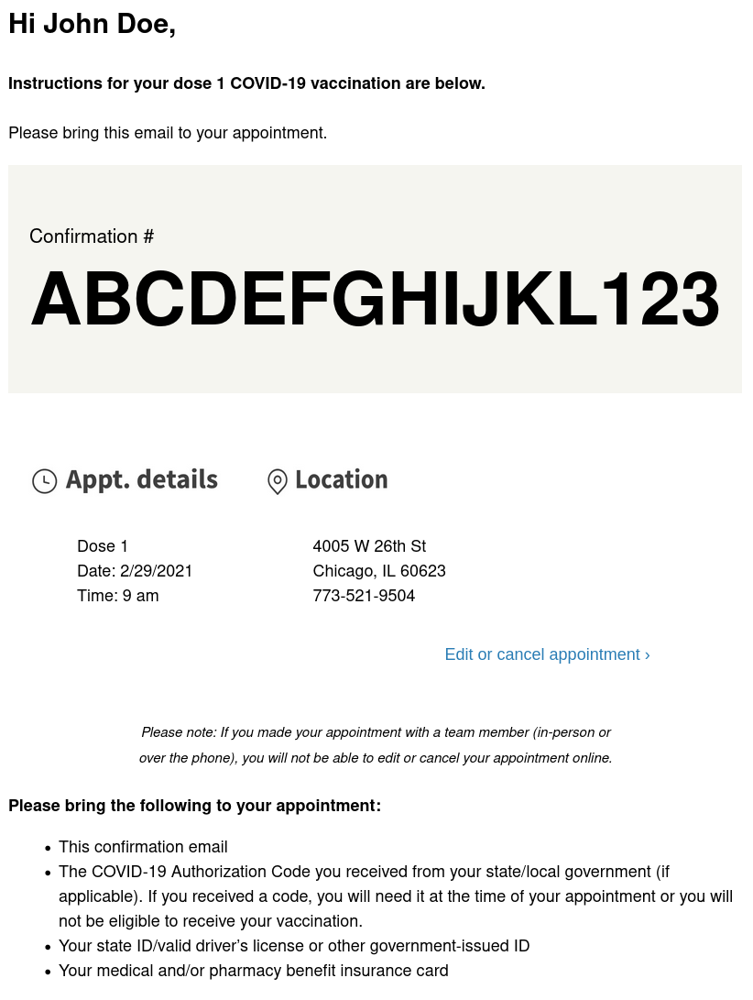

1. Go to your e-mail inbox
2. Locate an e-mail with subject "Your dose 1 appointment is confirmed"
3. Review the e-mail and instructions
4. Print out the e-mail
5. Download, print, and complete the [Walgreens Vaccine Administration Record Form](https://www.walgreens.com/images/adaptive/findcare/covid19/FY20_Community_VAR_OffSite_ENG_With_INS.pdf)

You're done! All that's left now is to get the vaccine on your scheduled date.

[<button>Previous Step</button>](./dose2)

## Example

