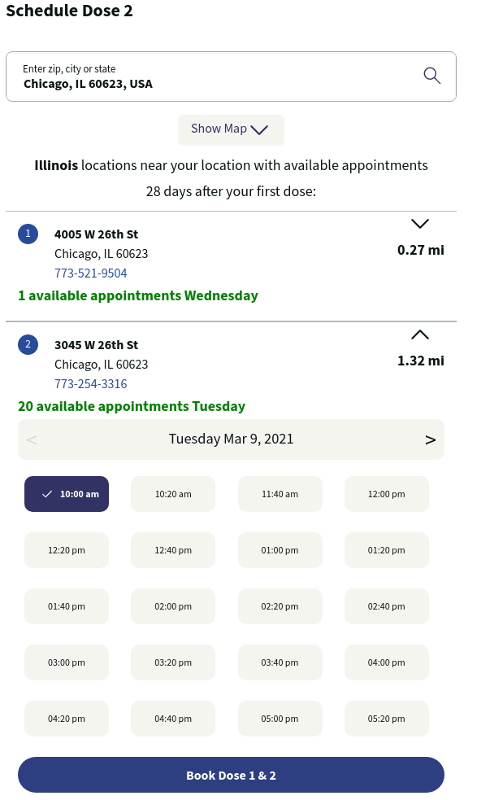

> 📢 Walgreens requires a second dose to be combined with a first dose. This second dose is scheduled at least 28 days out. If no availability for a second dose is available, [choose a different date on the previous page](./screener) and start over.

1. Enter your zip, city, or state into the input box
2. Press the magnifying glass to the right to search for available locations
3. **If you receive a message related to lack of availability**:
   1. Press the Back button located on the bottom
   2. [Select a different date or location](./location)
4. **If you receive the message**: "locations near your location with available appointments":
   1. Choose the location most convenient to you.
   2. Select the date of your choice
   3. Select the time slot of your choice
   4. **_Note_**: Due to high demand, it may be beneficial to select any time available to secure an appointment then reschedule to a more convenient time slot later.
   5. Press the purple "Book Dose 1 & 2" button
   6. A confirmation page will appear with your confirmation code and appointment details.
   7. An e-mail confirmation will be sent to you

After this step, [check your e-mail inbox for a confirmation e-mail](./confirmation).

[<button>Previous Step</button>](./location)
[<button>Next Step</button>](./confirmation)

## Example

