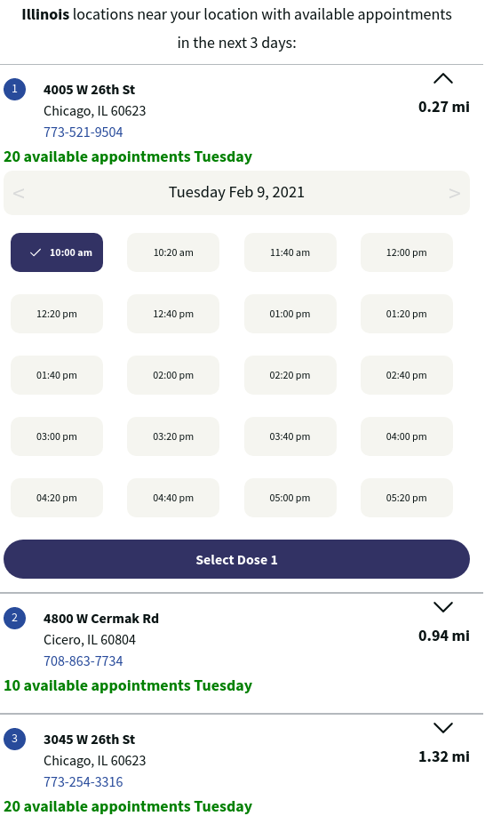

> 📢 Walgreens availability for 4 days out is available daily at 12:00 AM local time. You may want to consider performing these steps around that time. However, availability does come and go throughout the day as well.

1. Enter your zip, city, or state into the input box
2. Press the magnifying glass to the right to search for available locations
3. **If you receive the message**: "We don't have any available appointments coming up within 25 miles":
   1. Wait 5 minutes (Walgreens updates availability throughout the day)
   2. Press the magnifying glass again.
   3. Repeat until you see the message "locations near your location with available appointments"
   4. **_Note_**: After a while, you will be logged out and you will have to [restart the screener process](./screener).
4. **If you receive the message**: "locations near your location with available appointments":
   1. Choose the location most convenient to you.
   2. Select the date of your choice
   3. Select the time slot of your choice
   4. **_Note_**: Due to high demand, it may be beneficial to select any time available to secure an appointment then reschedule to a more convenient time slot later.
   5. Press the purple "Select Dose 1" button

Next, [select your second dose location and time](./dose2).

[<button>Previous Step</button>](./screener2)
[<button>Next Step</button>](./dose2)

## Example

