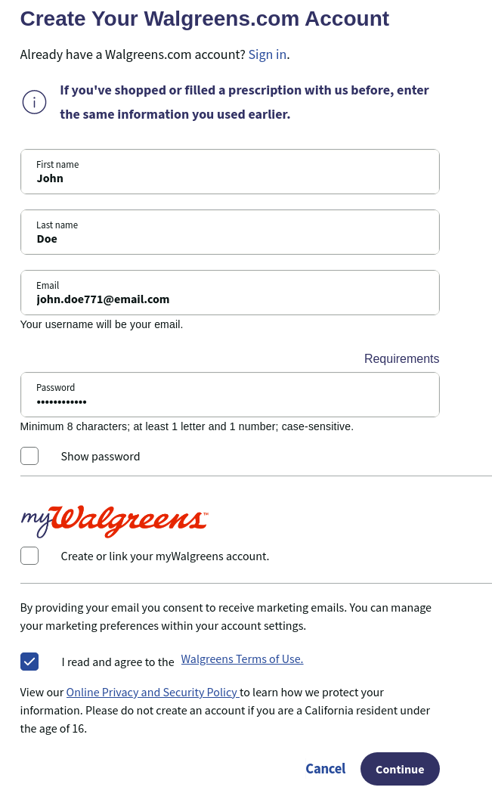

1. Go to the [Walgreens.com Online Registration Website](https://www.walgreens.com/register/regpersonalinfo?ru=%2Fyouraccount%2Fdefault.jsp)
2. Fill out your details on the website
   1. First Name
   2. Last Name
   3. E-mail address
   4. Password
3. Review and read the Walgreens Terms of Use
4. If the terms of use are accepted, check the box to the left of "I read and agree to the Walgreens Terms of Use"
5. Press the purple "Continue" on the bottom right

Next, [register for a pharmacy account](./register-pharmacy)

[<button>Previous Step</button>](./intro)
[<button>Next Step</button>](./register-pharmacy)

## Example

