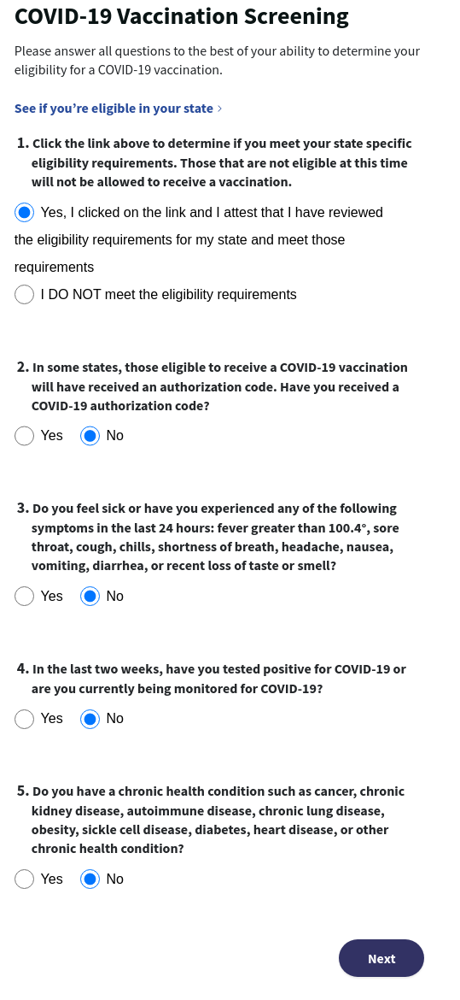

# COVID-19 Screener Instructions

The COVID-19 Screener consists of two parts:

1. An Introduction page detailing the process
2. A questionnaire to review vaccine eligibility

## Introduction Page

1. Go to the [COVID-19 screener introduction page](https://www.walgreens.com/findcare/vaccination/covid-19/).
2. Review the information on the page.
3. Press the purple "Get started" button on the bottom of the page.

## Questionnaire Page

1. Answer the questions on the questionnaire page according to your individual circumstances.

After answering the screener, you will either be eligible or ineligible to continue. If you are eligible, a "Vaccination recommended" page will appear. If not, it will say "Not eligible for vaccination at this time".

Once the screener has been completed, press the purple "Schedule vaccination" button. In the following page, you will need to [answer more questions](./screener2)

[<button>Previous Step</button>](./verify-identity)
[<button>Next Step</button>](./screener2)

## Example

