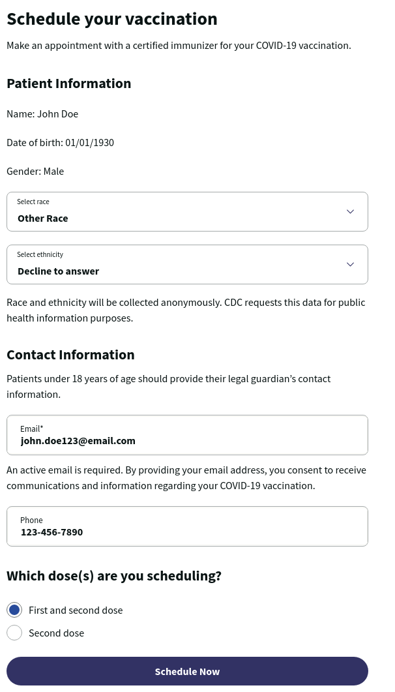

1. Answer required CDC questions
2. Enter contact information
3. Select the appropriate COVID-19 dose, either "First and second dose" or "Second dose"
4. Press the purple "Schedule Now" button

On the next page, you will [choose your COVID-19 vaccination location](./location)

[<button>Previous Step</button>](./screener)
[<button>Next Step</button>](./location)

## Example

