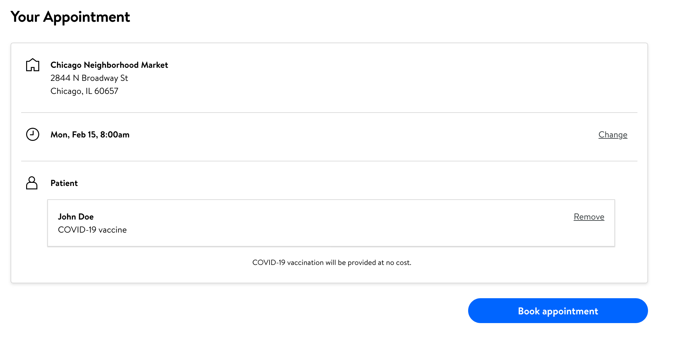

1. Review the selected Walmart, date, time, and patient details
2. **If the date or time is incorrect**: Press the change link and return to [the time slots step](./timeslot)
3. **If the patient information is incorrect**: Press the "Remove" link and return to the [patient step](./patient)
3. **If all information is correct**: press the blue "Book appointment" button

[<button>Previous Step</button>](./consent-registry)
[<button>Next Step</button>](./confirmation)

## Example

