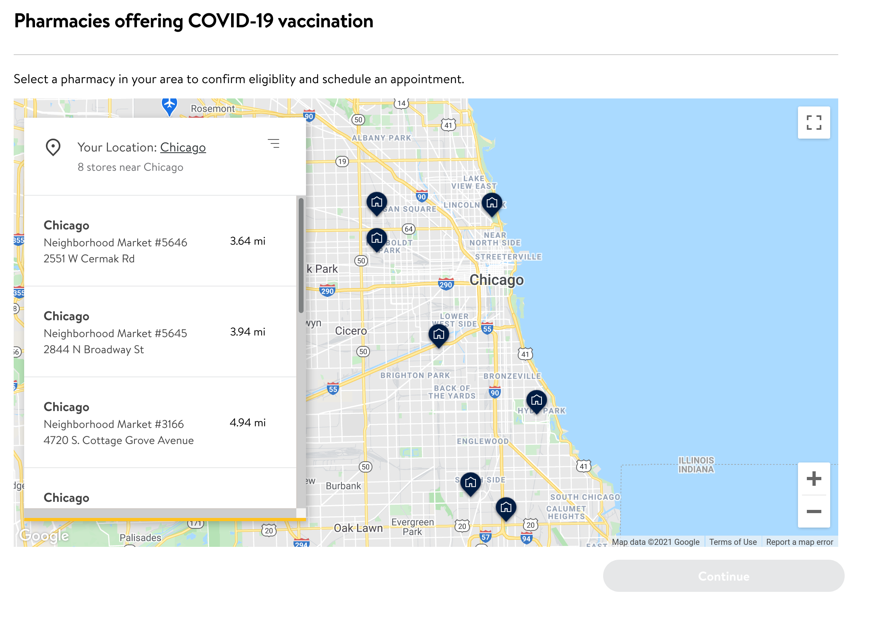

> 📢 Walmart availability is available daily at 12:00 AM local time You may want to consider performing these steps around those times. However, availability does come and go throughout the day as well.

1. Go to the [Walmart COVID-19 vaccination website](https://www.walmart.com/pharmacy/clinical-services/immunization/scheduled?imzType=covid&action=SignIn&rm=true)
2. Enter your zip, city, or state into the input box
3. **If you receive the message**: "Walmart pharmacies in this location do not administer COVID-19 vaccines yet. Please enter a different location or try again later."
   1. Enter a different zip code into the input box
   2. Press the "update location" link
4. Choose the location most convenient to you.
5. Press the blue "Continue" button

[<button>Previous Step</button>](./register-online)
[<button>Next Step</button>](./eligibility)

## Example

