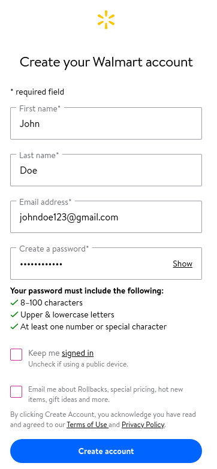

1. Go to the [Walmart.com Online Registration Website](https://www.walmart.com/account/signup?returnUrl=/pharmacy/clinical-services/immunization/scheduled?imzType=covid&action=SignIn&rm=true)
2. Fill out your details on the website
   1. First Name
   2. Last Name
   3. E-mail address
   4. Password
3. Review and read the Terms of Use
4. If the terms of use are accepted, press the blue "Create Account" on the bottom

[<button>Previous Step</button>](./intro)
[<button>Next Step</button>](./location)

## Example

